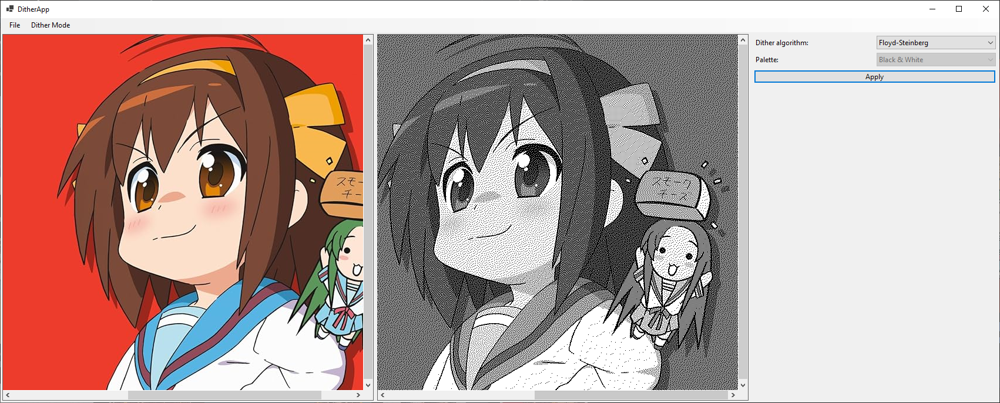
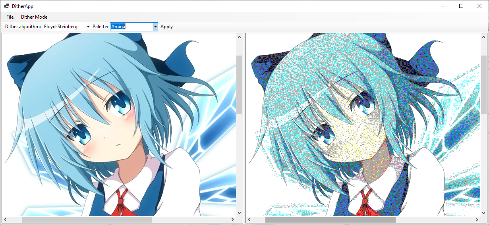

# Dither
## English
It's a simple ditherer written in WinForms.
### Features
* 5 dither algorithms
* Colorful and monochrome dither modes
* 18 palettes
## Russian
Простой дизер написанный на WinForms
### Особенности
* 5 алгоритмов дизеринга
* Цветной и монохромный режим дизеринга
* 18 палитр

## Monochrome dither mode

## Colorful dither mode

